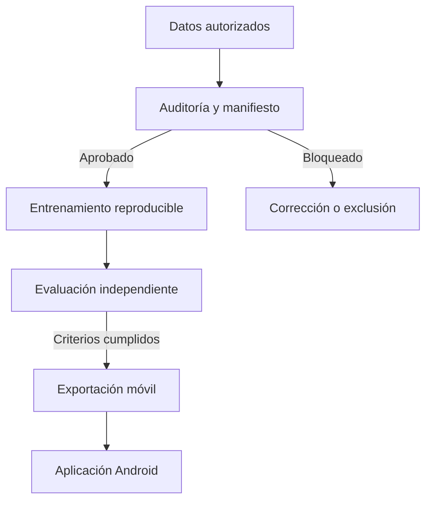

# Arquitectura del proyecto

## Objetivo técnico

Construir un prototipo móvil que estime compatibilidad con un patrón facial definido y validado, sin presentar la salida como diagnóstico o probabilidad clínica de LES.

## Componentes

### 1. Datos

- Imágenes almacenadas fuera de Git.
- Manifiesto versionado de forma privada.
- Identificador por sujeto para evitar fuga.
- Licencia y fundamento de etiqueta verificables.
- Controles de duplicados exactos y perceptuales.

### 2. Entrenamiento

- Línea base con transferencia de aprendizaje.
- Preprocesamiento idéntico entre Python y Android.
- Configuración, semillas, particiones y métricas conservadas por ejecución.
- Comparación de modelos únicamente sobre la misma partición congelada.

### 3. Evaluación

- Conjunto de prueba sin uso durante selección o ajuste.
- Métricas por imagen y, cuando corresponda, por sujeto.
- Sensibilidad, especificidad, precisión, F1, ROC-AUC y calibración.
- Intervalos de confianza e inspección de errores.
- Pruebas de atajos visuales: marcas, barras, fondos, fuente y dispositivo.

### 4. Aplicación móvil

- Captura guiada y validación de calidad.
- Inferencia local.
- Mensajes no diagnósticos.
- Sin persistencia de fotografías por defecto.
- Prueba de paridad numérica contra Python antes de liberar cada modelo.

## Criterio de avance

La etapa siguiente comienza solo cuando la anterior genera evidencia revisable. Un resultado de exactitud aislado nunca habilita la exportación móvil.
